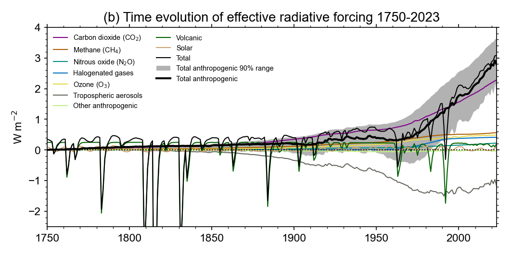

# Effective radiative forcing time series

This repository generates the following data and plots from the Climate Indicator Project:

- Greenhouse gas concentrations 1750-2023
- Effective radiative forcing 1750-2023

As part of the ERF time series, emissions are processed from CEDS and GFED.




The code also provides a probabilistic ensemble of 1000 forcing time series for the detection and attribution of climate change.

Code also caculates decadal rates of ERF change and human induced warming change


## Reproducibility

Create a conda environment. From the top directory of the repository run

```
conda env create -f environment.yml
```

The code is a series of notebooks in the `notebooks` folder. Some generate emissions or concentrations and need to be run first. This order should work.

- `contrails.ipynb`
- `biomass-emissions.ipynb`
- `slcf-emissions.ipynb`
- `trace-gas-global-mean.ipynb`
- `volcanic-forcing.ipynb`
- `make-forcing.ipynb`
- `forcing-analysis.ipynb`
- `radiative-forcing-barchart.ipynb`
- `decadal-trends.ipynb`

All ancillary data is provided in the repository or downloaded by the code except for three volcanic datasets that require registration. See the notes in the `volcanic-forcing.ipynb` and `contrails.ipynb` notebooks for how to obtain the data and where to download it to.

The Decadal trend plot uses data generated by the athropogenic warming repository.
