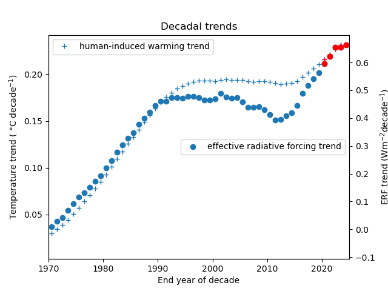

# Effective radiative forcing time series

[](https://doi.org/10.5281/zenodo.10706344)

This repository generates the following data and plots from the Climate Indicator Project:

- Greenhouse gas concentrations 1750-2024
- Effective radiative forcing 1750-2024

As part of the ERF time series, emissions are processed from CEDS and GFED.

**Please note that 2024 data is preliminary; in many cases it is based on extrapolations and estimates. The data will not be final until IGCC 2024 is published in early summer 2025.**


The code also provides a probabilistic ensemble of 1000 forcing time series for the detection and attribution of climate change.

Code also caculates decadal rates of ERF change and human induced warming change


## Reproducibility

Create a conda environment. From the top directory of the repository run

```
conda env create -f environment.yml
```

The code is a series of notebooks in the `notebooks` folder. Run the notebooks in numerical order to reproduce.

All ancillary data is provided in the repository or downloaded by the code except for six volcanic, contrails, and SLCFs datasets that either require registration or are not in the public domain. See the notes in the `volcanic-forcing.ipynb`, `mls-data.ipynb`, `biomass_emissions.ipynb`, `cams-slcf.ipynb` and `contrails.ipynb` notebooks for how to obtain the data and where to download it to. Additionally, the Hunga Tonga stratospheric water vapour calculation uses offline radiative transfer simulations that are not part of the repository (but the results are included in the data).

The Decadal trend plot uses data generated by the athropogenic warming repository.
